# Отчёт по лабораторной работе №1
Ибрахим Мохсейн Алькамаль

- [1 Цель работы](#цель-работы)
- [2 Выполнение лабораторной
  работы](#выполнение-лабораторной-работы)
  - [2.1 Построение графиков в
    Octave](#построение-графиков-в-octave)
  - [2.2 Разложение импульсного
    сигнала в частичный ряд
    Фурье](#разложение-импульсного-сигнала-в-частичный-ряд-фурье)
  - [2.3 Определение спектра и
    параметров сигнала](#определение-спектра-и-параметров-сигнала)
  - [2.4 Амплитудная
    модуляция](#амплитудная-модуляция)
  - [2.5 Кодирование сигнала.
    Исследование свойства самосинхронизации
    сигнала](#кодирование-сигнала-исследование-свойства-самосинхронизации-сигнала)
- [3 Выводы](#выводы)

# Цель работы

Целью данной работы является изучение методов кодирования и модуляции
сигналов с помощью высокоуровнего языка программирования Octave.
Определение спектра и параметров сигнала. Демонстрация принципов
модуляции сигнала на примере аналоговой амплитудной модуляции.
Исследование свойства самосинхронизации сигнала.

# Выполнение лабораторной работы

## Построение графиков в Octave

Запускаем Octave, создаем новый сценарий под названием plot_sin.m. В
окне редактора повторяем листинг по построению графика функции y = sin
x + 1/3 sin 3x + 1/5 sin 5x на интервале \[−10; 10\] (рис.
\[**fig:001?**\]).

Запускаем сценарий на выполнение, открывается окно с графиком (рис.
\[**fig:002?**\]). В рабочем каталоге появляются файла с графиками в
форматах .eps, .png (рис. \[**fig:003?**\]).

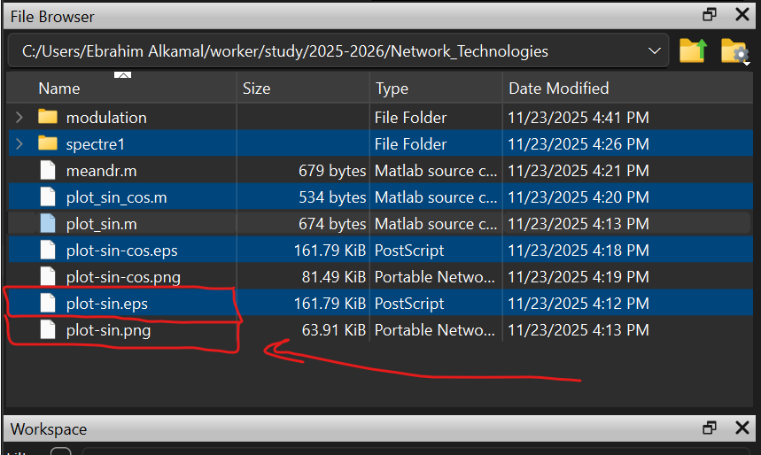

Сохраним сценарий под названием plot_sin_cos.m и изменим его так, чтобы
наодном графике располагались отличающиеся по типу линий графики функций
y1 = sin x + 1/3 sin 3x + 1/5 sin 5x, y2 = cos x + 1/3 cos 3x + 1/5 cos
5x. Итоговый листинг (рис. \[**fig:004?**\]).

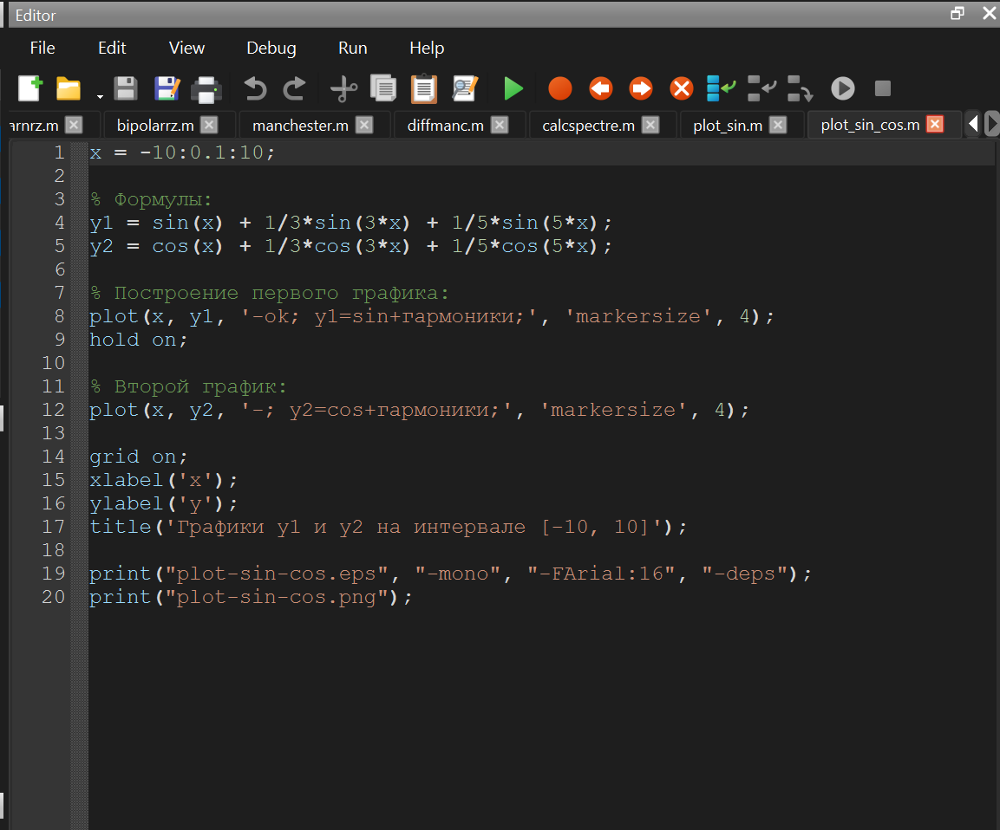

Запускаем, получаем еще один график (рис. \[**fig:005?**\]).

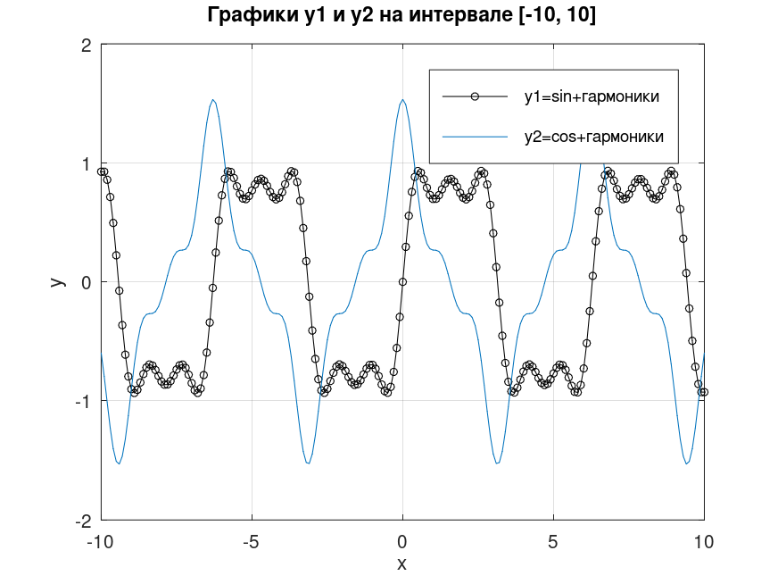

## Разложение импульсного сигнала в частичный ряд Фурье

Создадим новый сценарий meandr.m. В кодe зададим начальные значения.
Вычислим амплитуду гармоник и заполним массивы гармоник и элементов
ряда. Далее задаём массив значений гармоник массив элементов ряда. Для
построения в одном окне отдельных графиков меандра с различным
количеством гармоник реализуем суммирование ряда с накоплением и
воспользуемся функциями subplot и plot для построения графиков. Также
экспортируем полученный график в файл в формате .png (рис.
\[**fig:006?**\]), (рис. \[**fig:007?**\]).

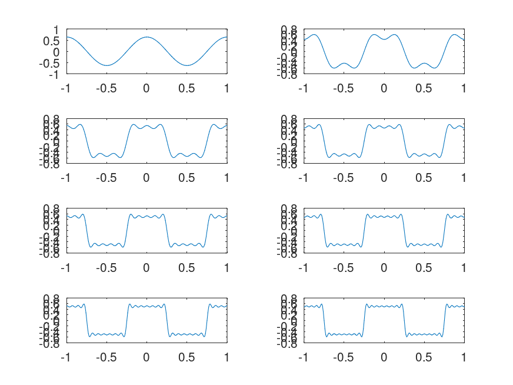

Также реализуем меандр через синусы (рис. \[**fig:008?**\]), (рис.
\[**fig:009?**\]).

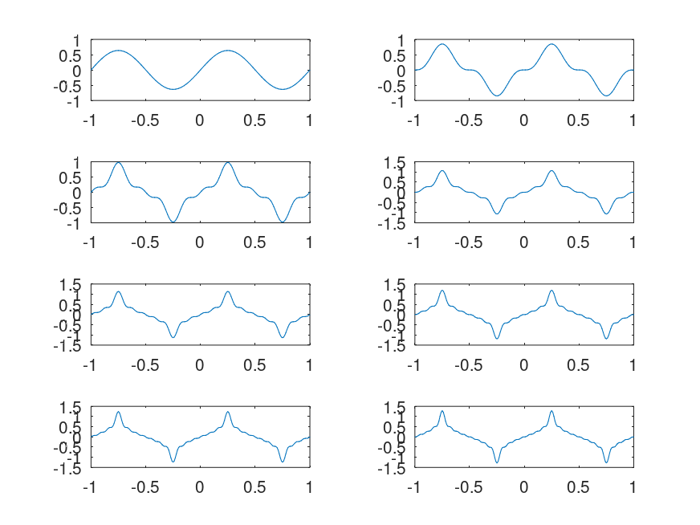

## Определение спектра и параметров сигнала

Создадим в рабочем каталоге каталог spectre1 и в нем новый сценарий
spectre.m. В коде сценария зададим начальные значения, а также два
синусоидальных сигнала разной частоты, построим графики сигналов (рис.
\[**fig:010?**\]), (рис. \[**fig:011?**\]).

Затем с помощью быстрого преобразования Фурье найдем спектры сигналов,
добавив в файл spectre.m код из мануала в ТУИСе. Учитывая реализацию
преобразования Фурье, скорректируем график спектра (рис.
\[**fig:012?**\]): отбросим дублирующие отрицательные частоты, а также
примим в расчёт то, что на каждом шаге вычисления быстрого
преобразования Фурье происходит суммирование амплитуд сигналов.

Получим следующие графики: график спектров синусоидальных сигналов (рис.
\[**fig:013?**\]) и исправленный график спектров синусоидальных сигналов
(рис. \[**fig:014?**\]).

Найдем спектр суммы рассмотренных сигналов, создадим каталог spectr_sum
и в нем spectre_sum.m (рис. \[**fig:015?**\]), (рис. \[**fig:016?**\]).

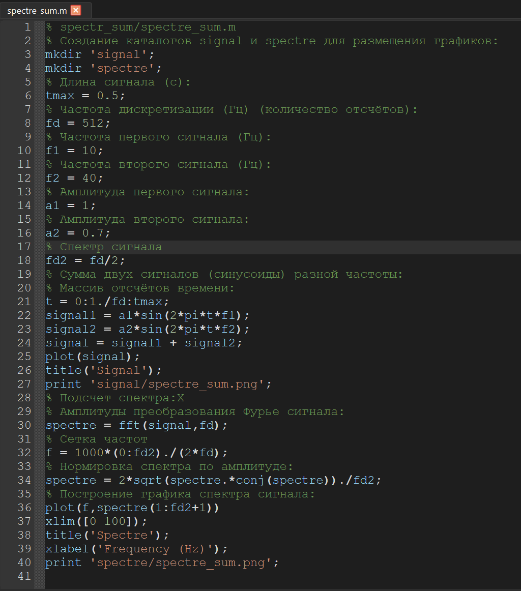

В результате должен получится аналогичный предыдущему результат (рис.
\[**fig:017?**\]), т.е. спектр суммы сигналов должен быть равен сумме
спектров сигналов, что вытекает из свойств преобразования Фурье.

## Амплитудная модуляция

В рабочем каталоге создадим каталог modulation и в нём новый сценарий с
именем am.m. Добавим в него код из мануала (рис. \[**fig:018?**\]).

В результате получаем, что спектр произведения представляет собой
свертку спектров (рис. \[**fig:019?**\]), (рис. \[**fig:020?**\]).

## Кодирование сигнала. Исследование свойства самосинхронизации сигнала

В рабочем каталоге создадим каталог coding и в нём файлы main.m,
maptowave.m, unipolar.m, ami.m, bipolarnrz.m, bipolarrz.m, manchester.m,
diffmanc.m, calcspectre.m.

В окне интерпретатора команд проверяем, установлен ли пакет расширений
signal: pkg list. Так как он не установлен, то устанавливаем его: pkg
list -forge и pkg install control signal (рис. \[**fig:021?**\]).

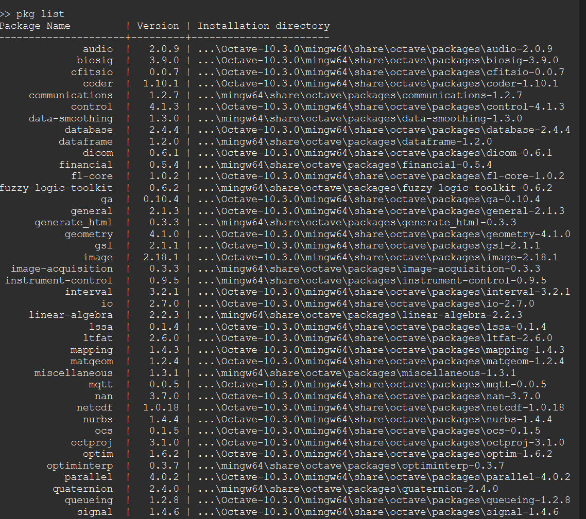

В файле main.m подключаем пакет signal и задаем входные кодовые
последовательности (рис. \[**fig:022?**\]).

Затем в этом же файле пропишем вызовы функций для построения графиков
модуляций кодированных сигналов для кодовой последовательности data
(рис. \[**fig:023?**\]).

Пропишем вызовы функций для построения графиков модуляций кодированных
сигналов для кодовой последовательности data_sync (рис.
\[**fig:024?**\]).

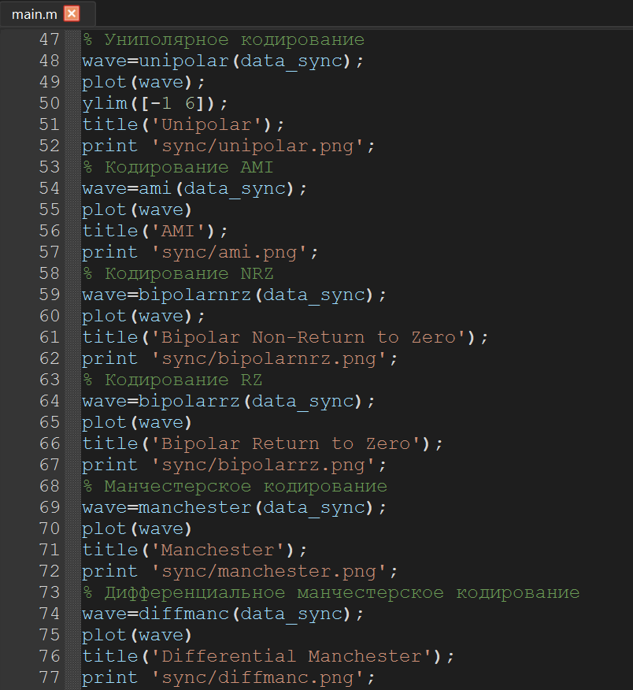

Далее в этом же файле пропишем вызовы функций для построения графиков
спектров (рис. \[**fig:025?**\]).

В файле maptowave.m пропишем функцию, которая по входному битовому
потоку строит график сигнала (рис. \[**fig:026?**\]).

В файлах unipolar.m (рис. \[**fig:027?**\]), ami.m (рис.
\[**fig:028?**\]), bipolarnrz.m (рис. \[**fig:029?**\]), bipolarrz.m
(рис. \[**fig:030?**\]), manchester.m (рис. \[**fig:031?**\]),
diffmanc.m (рис. \[**fig:032?**\]) пропишем соответствующие функции
преобразования кодовой последовательности data с вызовом функции
maptowave для построения соответствующего графика.

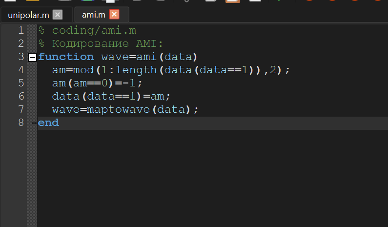

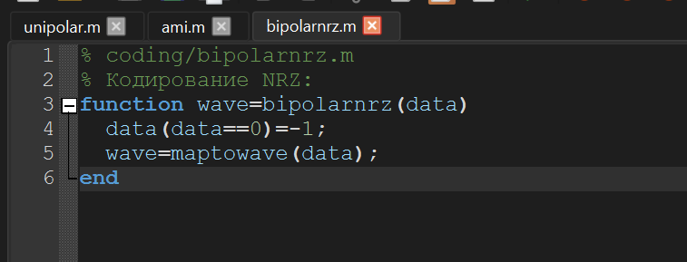

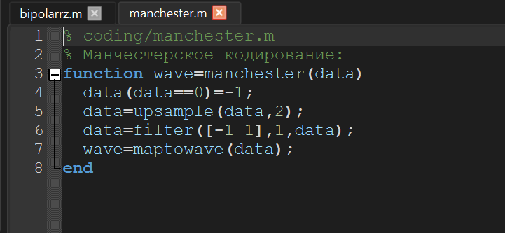

В файле calcspectre.m пропишем функцию построения спектра сигнала (рис.
\[**fig:033?**\]).

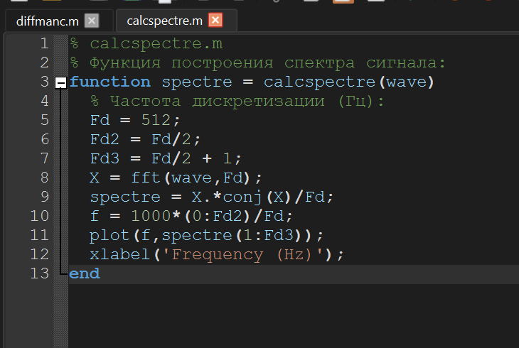

Запустим главный скрипт main.m. В каталоге signal должны быть получены
файлы с графиками кодированного сигнала (рис.
\[**fig:034?**\]-\[**fig:039?**\]), в каталоге sync — файлы с графиками,
иллюстрирующими свойства самосинхронизации (рис.
\[**fig:040?**\]-\[**fig:045?**\]), в каталоге spectre — файлы с
графиками спектров сигналов (рис. \[**fig:046?**\]-\[**fig:051?**\]).

# Выводы

В ходе выполнения данной лабораторной работы я изучила методы
кодирования и модуляции сигналов с помощью высокоуровнего языка
программирования Octave. Определила спектр и параметры сигнала.
Продемонстрировала принципы модуляции сигнала на примере аналоговой
амплитудной модуляции. Исследовала свойства самосинхронизации сигнала.
